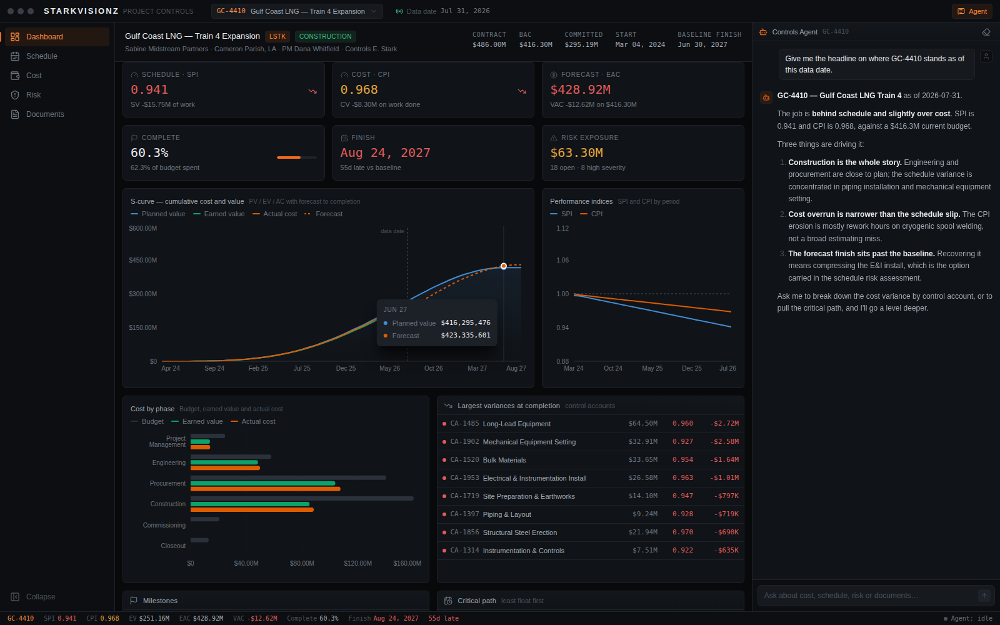
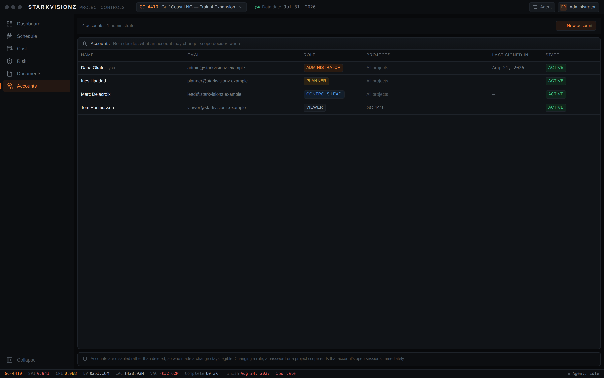

# Project Starkvisionz

A desktop-style cockpit for EPC project controls, with an agent that reads the
project registers directly and answers from them.

Starkvisionz is built for the way a controls lead actually works: one window, a
persistent left rail, a resizable workspace, and an agent panel that stays open
beside whatever you are looking at. Every figure on screen is derived from the
same tables the agent reads, so the dashboard and the agent never disagree.



## What's in it

| View | What it does |
|---|---|
| **Dashboard** | Earned-value KPIs, the S-curve (PV / EV / AC with forecast), SPI and CPI trend, cost by phase, milestones, critical path, and an alert roll-up |
| **Schedule** | WBS tree with a Gantt timeline — baseline against forecast, critical-path marking, milestone diamonds, zoom, filters, and an editable activity inspector |
| **Cost** | Control accounts with budget / committed / actual / earned / CPI / EAC / VAC, a diverging variance chart, period cash flow and the transaction ledger |
| **Risk** | 5×5 probability-impact matrix with click-through drilldown, exposure by category, and an editable risk inspector with mitigation tracking |
| **Changes** | The change-order register — trends, submissions, approvals — with the budget movement each one causes, approval turnaround, and where the change is coming from |
| **Documents** | Deliverable register with issue status, client review codes, overdue tracking, and approval progress by discipline |
| **Agent** | A streaming chat panel that answers from the live database — cost variance, critical path, risk exposure, forecast basis, and recommendations |

## Running it

```bash
npm install
npm run db:seed     # builds data/starkvisionz.db and fills it with a demo portfolio
npm run dev         # http://localhost:3000
```

The database is a local SQLite file; there is no external service to configure.

### Before you expose it

Starkvisionz holds a project's cost, schedule and commercial position, so it runs
behind a session gate. Set a signing key and create the first account:

```bash
npm run user -- secret          # -> STARKVISIONZ_SESSION_SECRET=...   (into .env.local)
npm run user -- add --email you@example.com --name 'Your Name' --role admin
```

With a secret set, every page and every API route requires a session. Without
one, Starkvisionz runs unauthenticated **only** in development, as a local
administrator; in production it returns 503 rather than serving the registers to
anyone who can reach the host.

There is no sign-up page. The first account is created on the host by somebody
who already has it, and every account after that by an administrator.

### Who can do what

Accounts are local — stored in the same SQLite file, passwords hashed with
scrypt — and carry one of four roles:

| Role | Read | Schedule | Documents | Cost & changes | Risk | Accounts |
|---|:-:|:-:|:-:|:-:|:-:|:-:|
| **Viewer** | ● | | | | | |
| **Planner** | ● | ● | ● | | | |
| **Controls lead** | ● | ● | ● | ● | ● | |
| **Administrator** | ● | ● | ● | ● | ● | ● |

Change orders sit under cost: approving one moves a control-account budget, so
it is the same permission that governs the cost position.

Reading includes the agent panel: it answers from the whole project, so asking
it something needs the same access as opening the register.



An account can also be **scoped to particular projects**, optionally at a
different role on each — a planner on one train and a reader on the next is the
normal case on a portfolio. An account with no scoping sees everything at its
own role, including projects added later. Out of scope reads as *not found*
rather than *forbidden*: which projects exist is itself commercially
interesting.

```bash
npm run user -- list
npm run user -- scope --email planner@example.com --projects GC-4410,NV-2208:viewer
npm run user -- role  --email planner@example.com --role controls_lead
npm run user -- disable --email someone@example.com
```

Administrators can do all of that in the **Accounts** view as well. Accounts are
disabled rather than deleted, so who made a change stays legible. Changing a
role, a password or a project scope ends that account's live sessions on the
next request.

### The agent

The agent panel works with no configuration. Without an API key it runs a local
analyst that composes its answers from the same tables — grounded, deterministic,
and never inventing a figure.

To route it through Claude instead, copy `.env.example` to `.env.local` and set:

```bash
ANTHROPIC_API_KEY=sk-ant-...
```

The status bar at the bottom right shows which one answered. Either way the
request builds a fresh briefing from the database on every turn, so the agent
cannot cite a number the tables do not support.

## The demo portfolio

`npm run db:seed` builds three EPC projects, each telling a different story:

| Project | Contract | Phase | SPI | CPI | Reads as |
|---|---|---|---|---|---|
| **GC-4410** Gulf Coast LNG — Train 4 | $486M LSTK | Construction | 0.941 | 0.968 | Behind schedule, modestly over cost |
| **NV-2208** Silver Basin Solar + Storage | $268M EPCM | Construction | 1.017 | 1.011 | Ahead of plan on both |
| **AB-1750** Scotford Blue Hydrogen | $158M Cost-Plus | Engineering | 0.972 | 0.938 | Early, with cost pressure already |

The generator is deterministic — a fixed PRNG seed per project code — so the
numbers are the same on every re-seed. Change orders are seeded the same way the
app writes them: the approved ones sum to exactly what each control account's
budget was drafted to hold, and the budgets are then derived from that register,
so every dollar of approved change traces to an order from the first row. Because earned value is derived from
activity progress rather than written directly, the seeder hits each project's
target SPI by scaling the *activity percentages* and iterating the same roll-up
the API runs, then shapes actual cost around the resulting earned value to hit
the target CPI. Per-account variance is real; the headline matches the story;
and the seeded database satisfies the same invariant a live edit does.

It also creates four demo accounts, one per role — the password is printed by
the seeder — so the access model can be tried rather than read about. The
read-only one is scoped to a single project, which is what makes the portfolio
filter visible. They are skipped under `NODE_ENV=production` unless you pass
`--demo-users` on purpose, and the seeder never touches an account it did not
create.

`npm run db:reset` rebuilds from scratch.

## How it fits together

```
src/
  app/
    (app)/                everything behind the session gate: dashboard,
                          schedule/, cost/, risk/, documents/
    login/                the one page a signed-out visitor can render
    api/                  REST routes + the streaming /api/chat endpoint
    globals.css           the Starkvisionz design tokens
  middleware.ts           session gate in front of every page and route
  components/
    shell/                title bar, sidebar, status bar, resizable frame
    charts/               Recharts wrappers over one shared chart theme
    chat/                 agent panel, SSE client, markdown renderer
    dashboard/ schedule/ cost/ risk/ changes/ documents/ users/
    ui/                   panels, tables, badges, stat tiles, controls
  lib/
    schema.sql            the full EPC schema
    db.ts queries.ts      connection and the typed query + metrics layer
    rollup-core.mjs       schedule -> cost roll-up, shared with the seeder
    change-orders-core.mjs  change register -> control-account budgets
    validation.ts         Zod schemas shared by the UI and the API
    rbac.ts               roles, permissions, and the one `can()` they answer
    auth.ts guard.ts      sessions, and the check every route runs
    users.ts              the account store, over accounts-core.mjs
    accounts-core.mjs     password hashing and account writes, shared with the CLI
    rate-limit.ts         token buckets, keyed on the account where there is one
    agent-context.ts      builds the agent's briefing from the database
    agent-local.ts        the offline analyst
scripts/seed.mjs          the demo-portfolio generator
scripts/user.mjs          account administration, and the bootstrap path
```

### A few decisions worth knowing

**Progress and money are one chain, not two.** `src/lib/rollup-core.mjs` owns
the only path from schedule to cost:

```
activity % complete
  -> budget-weighted progress of the WBS node
  -> control-account earned value
  -> forecast at completion
  -> the EVM period at the data date
  -> projectMetrics(), and so every view and the agent briefing
```

Marking an activity complete moves SPI, CPI, EAC and the S-curve in the same
transaction. Nothing else writes `cost_accounts.earned_value` — the seeder calls
that same file, so the invariant holds from the first row inserted rather than
only after the first edit. Actual cost is deliberately outside the chain: it
comes from the ledger, not from progress.

`projectMetrics()` in `src/lib/queries.ts` is the single definition of SPI, CPI,
EAC, ETC, VAC and TCPI on top of that roll-up.

**The change register is where budgets come from.**
`src/lib/change-orders-core.mjs` owns the step above that roll-up:

```
change order approved (allocated to a control account)
  -> cost_accounts.approved_changes  (SUM of approved orders on that account)
  -> cost_accounts.current_budget    (original + approved)
  -> recalculateProject()            -> earned value, EAC, the EVM period
```

Nothing else writes `approved_changes` or `current_budget`. It re-derives from
scratch rather than applying deltas, so an order that is rejected after approval
— or moved to a different account — releases the money it was holding instead of
stranding it. Approving therefore requires an allocation: you cannot add to a
budget without saying which budget, and the account named must belong to the
same project.

Pending change is kept out of the budget on purpose. A trend is exposure the
project carries, not money it has, and the two never share a tile or a total —
that is how a forecast quietly absorbs a claim nobody has agreed to pay.

Schedule impact is recorded and **not** applied to forecast dates, for the same
reason the schedule is a register rather than a solver: moving a finish date on
approval would assert an entitlement no critical path produced.

**Authorisation is asked once, about a project.** `src/lib/rbac.ts` holds the
role-to-permission table and a single `can(principal, permission, projectId)`.
The API routes call it through `src/lib/guard.ts`; the UI calls it directly to
decide what to offer. One table, both consumers — the alternative is an
interface that hides a button the API would have accepted, or offers one it
refuses.

Nearly every check passes a project id. Without one the question becomes "could
this account ever do this", which is the wrong question the moment somebody is
scoped to part of the portfolio — and it is how a scoped user gets shown an
edit button that 404s. A row is authorised against the project it belongs to
rather than the URL it arrived on, so knowing an id is not a way around scoping.

**Sessions carry the account, and revocation is a column.** The cookie is a
signed bearer holding the account id and that account's `session_version`. There
is no server-side session table to lose on a restart; ending a session is a
version bump, which is what makes a password change, a role change or a
deactivation take effect on the next request rather than in twelve hours. The
edge middleware checks the signature and expiry, because that is all it can
reach; the Node routes re-resolve the account against the database, which is
where a since-revoked session is actually caught.

**The agent gets a briefing, not a database handle.** Every chat turn rebuilds a
plain-text snapshot of the project from the current tables and hands that to the
model as its only source of fact. Answers stay current without the agent needing
query access.

**Charts never carry two scales.** Where two measures differ by an order of
magnitude — period spend against cumulative cost — they get two charts rather
than a second axis. The categorical palette is checked for colourblind
separation and contrast against the dark surface; the values live in
`globals.css` under `--color-series-*`.

**The API validates values, not just field names.** `src/lib/validation.ts`
holds Zod schemas shared by the UI and the routes: percent complete is 0–100,
statuses are enums, dates must be real calendar days, a forecast finish cannot
precede its start, risk scores are 1–5. A column allowlist stops a caller naming
an arbitrary column; these stop them putting `631` into an allowed one. Derived
fields — earned value, severity, expected value — are recomputed server-side and
rejected if supplied.

**Writes are rate limited, and the limit is not caller-controlled.** Token
buckets cover the agent endpoint (the only path that can spend money at a
provider), the write routes, and login.

The identity those buckets key on matters more than the numbers. `X-Forwarded-For`
is a list the client can prepend to, so keying on its leftmost value lets anyone
mint a fresh bucket per request — that defeats a limit rather than weakening it.
Starkvisionz believes the header only when `STARKVISIONZ_TRUSTED_PROXIES` says how many
proxies sit in front, and then reads only the entry the innermost trusted proxy
observed. With none declared, every caller shares one bucket: legitimate users
throttle together, which is the safe direction to be wrong in. A second
instance-wide ceiling bounds the total regardless of where traffic comes from.

Chat messages are capped and oversized bodies refused before buffering.

**The schedule is a register, not a solver.** Starkvisionz stores predecessors, float
and critical-path flags but does not run CPM. Editing a forecast date does not
move successors or recompute float, and the activity inspector says so rather
than letting a planner assume otherwise. A real scheduling layer — or ingesting
calculated dates from P6/MSP — is the next step for that view.

## CI

`.github/workflows/ci.yml` runs on every pull request: typecheck, lint, build,
seed, then `scripts/smoke.mjs` against the built server.

The smoke test asserts the things this README claims rather than leaving them
as assertions in prose — that a schedule edit moves project EVM, that approving a
change order moves the budget it names and rejecting it gives that money back,
that no page,
read or write is reachable without a session, that a forged cookie is refused,
that each role is allowed exactly what its permissions say and refused the
rest, that a scoped account cannot see or reach a project it was not granted,
that changing an account ends the sessions it already had, that out-of-range and
unknown fields are rejected, that a forged `X-Forwarded-For` cannot defeat the
rate limit, and that the agent still streams SSE and quotes the current
figures. It runs with no `ANTHROPIC_API_KEY`,
so it exercises the local analyst and never depends on a provider.

## Scripts

| Command | Does |
|---|---|
| `npm run dev` | Development server on :3000 |
| `npm run build` / `npm start` | Production build and serve |
| `npm run db:seed` | Build and populate the database |
| `npm run db:reset` | Delete and rebuild it |
| `npm run typecheck` | `tsc --noEmit` |
| `npm run lint` | ESLint over the whole tree |
| `npm run smoke` | Assert the auth gate, roles, roll-up, change-order chain, validation and streaming against a running build |
| `npm run user -- list` | Accounts, roles and project scope |
| `npm run user -- add` | Create an account — the bootstrap path for the first one |
| `npm run user -- secret` | Generate a `STARKVISIONZ_SESSION_SECRET` |

## Stack

Next.js 15 (App Router) · React 19 · TypeScript · Tailwind CSS v4 · SQLite via
better-sqlite3 · Zod · Recharts · react-resizable-panels · lucide-react ·
`@anthropic-ai/sdk` for the streaming agent. Sessions, password hashing and
role-based access use `node:crypto` and the app's own tables — no auth
dependency, and no identity provider to configure.
